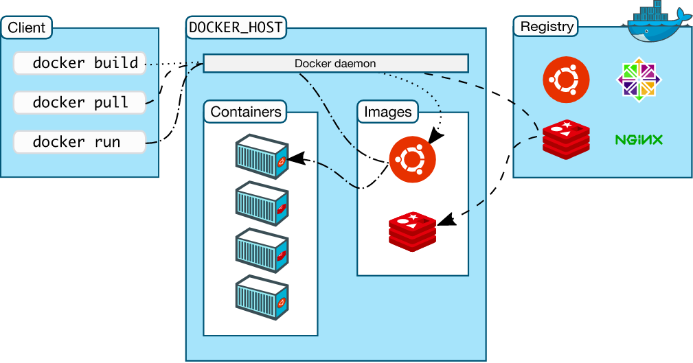

# 新手视角的 Docker

   

    最近投入的一个项目后台是 PHP + MySQL + Apache，且其它各种环境配置起来特别麻烦。还好使用了 docker，方便了不少。
    于是作为初学者，总结了部分知识并整理了一点点资料。

## Docker 简介  

### Docker 是什么:  

[官网](https://www.docker.com/what-docker)是怎么介绍的，“Docker is the world’s leading software containerization platform"。其实翻译一下就是，“Docker 是容器的一种封装”！__Docker__ 在 __容器__ 的基础上，进行了进一步的 __封装__，从文件系统、网络互联到进程隔离等等，极大的简化了容器的创建和维护。

### 容器（Container）与虚拟机（Virtual Machines）的区别

 

 

上面这两张图片来自[官网](https://www.docker.com/what-container)，可以很清晰的看出 Docker 与 虚拟机 的区别.

* 虚拟机     
虚拟机是物理硬件的抽象，是虚拟出一套硬件后在其上运行一个完整操作系统，在该系统上再运行所需应用进程。管理程序允许多个虚拟机在一台机器上运行，每个虚拟机包括一个操作系统的完整副本、一个或多个应用程序、必要的二进制文件。因此虚拟机可以实现在同一电脑下，根据项目情况进行环境配置并做到相互隔离，但是虚拟机占用资源多体积大速度慢。

* 容器    
容器内的应用进程直接运行于宿主的内核，容器内没有自己的内核，而且也没有进行硬件虚拟。多个容器可以在同一台机器上运行，并与其他容器共享OS内核，每个容器在用户空间中作为单独的进程运行。因此容器同样也可以实现不同项目的不同环境配置和隔离，且占用资源少体积小速度快！而 Docker 正是基于容器的一种封装。

## 相关概念

 

从图中可以看出三个概念：容器（container），镜像（image），以及仓库（repository）。

### Docker 镜像（image）   

Docker 镜像是用于创建 Docker 容器的模板。操作系统分为内核和用户空间，对于 Linux 而言，内核启动后，会挂载 root 文件系统为其提供用户空间支持。而 Docker 镜像，就相当于是一个 root 文件系统，它将运行时所需要的所有东西(如设置，依赖包，系统工具等)打包进里面，是一个轻量级的、独立的、可执行的软件包。

### Docker 容器

Docker 容器是独立运行的一个或一组应用。如果把 Docker 镜像比作是一个面向对象中的类，那么 Docker 容器就是实例。一个类可以 new 多个实例，同样一个 Docker 镜像也可以生成多个同时运行的 Docker 容器实例。

### 仓库（repository）

Docker 仓库用来保存镜像，可以理解为代码控制中的代码仓库。[Docker Hub](https://user-gold-cdn.xitu.io/2018/3/11/1621161e281296d9) 提供了庞大的镜像集合供使用。

## 使用 Docker

### 安装 Docker 

Docker 分为 社区版本（Community Edition）和 企业（Enterprise Edition) 两个版本，个人的话直接安装社区版本即可。[官方手册](https://docs.docker.com/install/) 中有不同系统的安装步骤，我使用的是Ubuntu，将手册中 [Ubuntu的安装](https://docs.docker.com/install/linux/docker-ce/ubuntu/#set-up-the-repository) 过程复制了下来。  

```bash
# Update the apt package index:
$ sudo apt-get update
# Install packages to allow apt to use a repository over HTTPS:
$ sudo apt-get install \   
    apt-transport-https \   
    ca-certificates \   
    curl \   
    software-properties-common 
# Add Docker’s official GPG key:
$ curl -fsSL https://download.docker.com/linux/ubuntu/gpg | sudo apt-key add -
# set up the stable repository.
$ sudo add-apt-repository \
    "deb [arch=amd64] https://mirrors.ustc.edu.cn/docker-ce/linux/ubuntu \
    $(lsb_release -cs) \
    stable"
# Update the apt package index:
$ sudo apt-get update  
# Install the latest version of Docker CE
$ sudo apt-get install docker-ce 
```

### 添加普通用户到group

避免每次操作 Docker 都需要 sudo 的权限。

```bash
# 将普通用户(我这里是qqqian)添加到用户组
$ sudo gpasswd -a qqqian  docker
# 修改权限
$ sudo chmod a+rw /var/run/docker.sock
```

### 常用命令

太多太多了，下面贴出了很少很少的一部分命令。
* docker --help（docker 自带，所有命令一应俱全）
* [菜鸟教程 - docker 命令行大全](http://www.runoob.com/docker/docker-command-manual.html)

```bash
# 添加镜像：Docker 官方提供的 image 文件，都放在library组里面，所以它的是默认组，hello-world是 image 文件的名字。
$ docker image pull library/hello-world
# 查找 ubuntu镜像
$ docker search ubuntu
# 列出镜像
$ docker image ls
# 删除镜像 hello-world
$ docker image rm hello-world
# 导入镜像:
$ docker import [OPTIONS] file|URL|- [REPOSITORY[:TAG]]
# 启动 hello-world:  命令会从 image 文件，生成一个正在运行的容器实例。如果本地没有 hello-world 镜像，那么则会去 library 中拉取
$ docker run hello-world
# 启动容器：
$ docker container run hello-world
# 列出容器
$ docker ps
# 进入运行的容器： -t 分配一个伪终端
$ docker exec -t CONTAINER
# 将镜像名为 konwnsec 的 3000 端口映射到本机的 8080端口；并启动 Bash，保证用户可以使用 Shell；容器的 Shell 映射到当前的 Shell
docker container run -p 8080:3000 -it knownsec /bin/bash
```

### 定制镜像 Dockerfile

定制镜像，其实上就是定制镜像的配置文件。Docker 会从 dockerfile 这个脚本中一步步读取其中包含的指令进行构建镜像。网上太多资料，参考下面几个链接。

* [Dockerfile reference](https://docs.docker.com/reference/builder/)        
* [Best practices for writing Dockerfiles](https://docs.docker.com/articles/dockerfile_best-practices/)    
* [使用 Dockerfile 定制镜像](https://yeasy.gitbooks.io/docker_practice/content/image/build.html)      
* [Dockerfile 指令详解](https://yeasy.gitbooks.io/docker_practice/content/image/dockerfile/)    
* [常见 Dockerfile 指令](http://seanlook.com/2014/11/17/dockerfile-introduction/)    
### 配置网络

* [Configure networking](https://docs.docker.com/network/)    
* [高级网络配置](https://yeasy.gitbooks.io/docker_practice/content/advanced_network/)    
* [Docker网络详解](http://www.infoq.com/cn/articles/docker-network-and-pipework-open-source-explanation-practice)   

### 安全

* [Docker安全](https://juejin.im/entry/577083fd5bbb5000596a1528)   
* [安全](https://yeasy.gitbooks.io/docker_practice/content/security/)   

### 数据管理

* [Manage application data](https://docs.docker.com/storage/#choose-the-right-type-of-mount)      
* [Docker 数据管理](https://yeasy.gitbooks.io/docker_practice/content/data_management/)   

## 总结

刚开始学习 Docker，很多东西了解得不深入不全面，只知道一点表象知识。Docker 的命令很多，Dockerfile 配置文件的命令也很多，所以需要经常使用才能牢记。高级网络配置，安全等暂时还不了解的知识希望在以后的路上慢慢补上来！