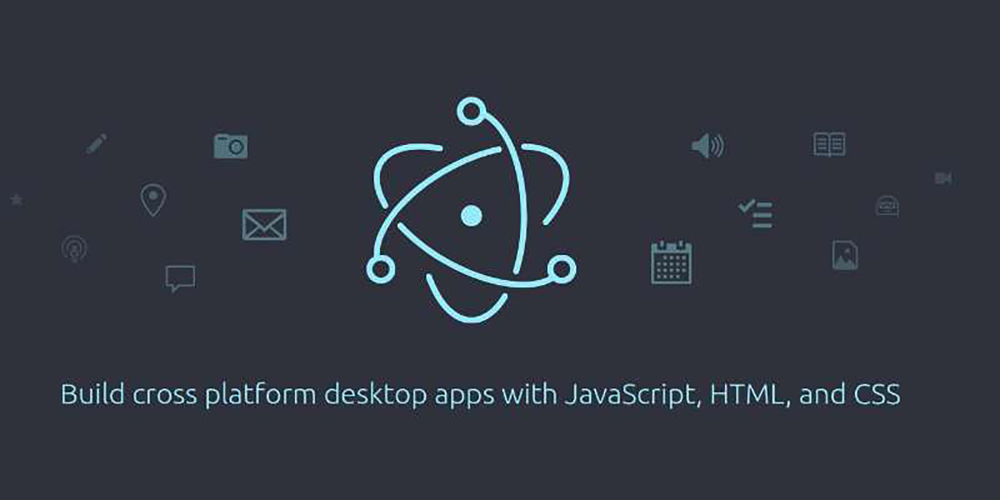
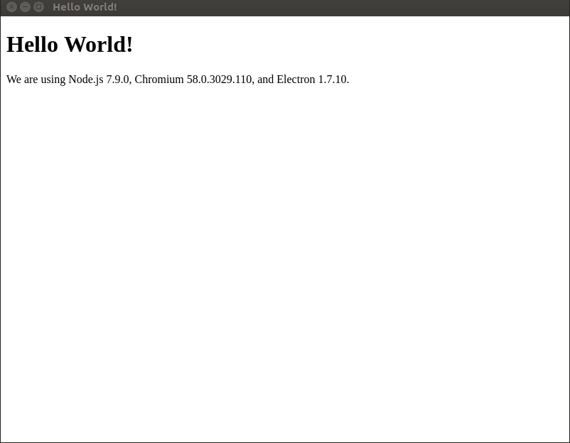
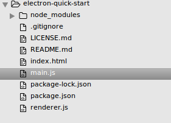
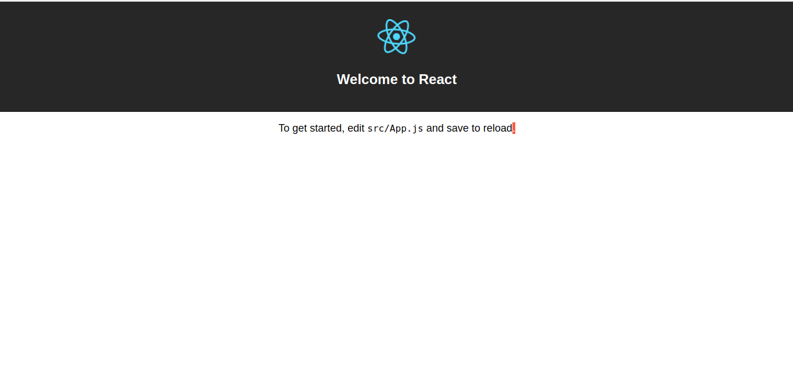
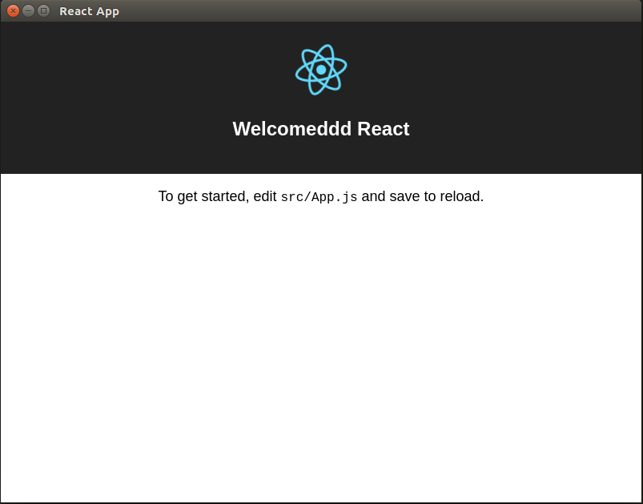

# React+Electron搭建一个桌面应用



> 因为文章的格式自己弄了好久啊，所以气不过就必须放在github上了。内容不重要，重要的是自己第一次正儿八经的仔细考虑markdown格式规范，呜呜呜~~~

​当你冲这个标题点进来的时候，我猜你一定知道 React 是什么，更多详情请[戳这里](https://reactjs.org/)，就不介绍React了，一个神般存在的前端框架。另外，浏览器和移动端横行的时代，为什么还需要桌面应用？我就不解释了，反正优点很多，做为技术多学一点总没错。

## Electron 简单介绍

### 是什么?

__[官网](https://electronjs.org/docs/tutorial/about)是这么介绍的：__

  [Electron](https://electronjs.org/) is an open source library developed by GitHub for building cross-platform desktop applications with HTML, CSS, and JavaScript. Electron accomplishes this by combining [Chromium](https://www.chromium.org/Home) and [Node.js](https://nodejs.org/) into a single runtime and apps can be packaged for Mac, Windows, and Linux.

__简单翻译一下就是：__

  ​[Electron](https://electron.atom.io/) 是一个由 GitHub 开发的开源库，通过将 [Chromium](https://www.chromium.org/Home)) 和[Node.js](https://nodejs.org/) 组合并使用 HTML，CSS 和 JavaScript 进行构建 Mac，Windows，和 Linux 跨平台桌面应用程序。    

__隐藏意思：__

  让前端开发者快乐简单拥抱桌面应用！

### __原理是?__

   上面已将说了，[Electron](https://electron.atom.io/) 通过将 [Chromium](https://www.chromium.org/Home) 和 [Node.js](https://nodejs.org/) 组合到单个 runtime 中来实现的。

__node.js:__

  如果你不知道 node.js，那还等什么快[戳这里](https://nodejs.org/en/)，看一看世界上最温柔可爱的语言。它借助于 Google 的 V8 引擎，**Node.js** 是一个能够在服务器端运行 JavaScript 的开放源代码、跨平台 JavaScript 运行环境，更多解释请[戳维基百科](https://zh.wikipedia.org/wiki/Node.js)。

__Chromium:__

   Chromium 或许你没听说过，但是你一定听说过 chrome 吧！Chromium 是 Google 的开源浏览器，是 chrome 背后的那个不太稳定更新快的兄弟版，详情[戳这里](https://www.chromium.org/Home)。

__组合:__

  Electron 创建的应用使用网页作为其 GUI ,因此你可以将其当成由 JavaScript 控制的迷你精简版Chromium 浏览器。也可以将 Electron 当成 node.js 变体，只不过它更专注于桌面应用而非 Web 服务器。在 Electron 中, 把 `package.json` 中设定的 `main` 脚本的所在进程称为 **主进程**。这个进程中运行的脚本也可通过创建网页这种方式来展现其 GUI。 因为 Electron 是通过 Chromium 来显示页面,所以 Chromium 自带的多进程架构也一同被利用。这样每个页面都运行着一个独立的进程,它们被统称为 **渲染进程**。通常来说,浏览器中的网页会被限制在沙盒环境中运行并且不允许访问系统原生资源。但是由于 Eelectron 用户可在页面中调用 Node.js API，所以可以和底层操作系统直接交互。

### __优缺点？__

  总之，优点肯定大于缺点。

__优点:__

  方便快捷的开发桌面应用，跨平台，对前端开发者友好，活跃的社区，丰富的api......

__缺点:__

  性能肯定比不上原生的桌面应用，发布的包貌似有一点点大。

### __怎么开始?__

  如果不是假前端，那么你电脑肯定安装好了 git 和 node。

  ```bash
  # github上有一个 electron-quick-start 仓库克隆下来
  git clone https://github.com/electron/electron-quick-start
  # 进入文件夹
  cd electron-quick-start
  # 安装依赖包并运行
  npm install && npm start
  ```
  
  然后，你桌面应用就创建成功了如下图所示！

  

  打开你的 electron-quick-start 文件夹，你的项目结构如下图：

  

  其中，main.js 是你的启动文件，index.html 是你的入口文件。

## React 结合 Electron

上面简单的介绍了一下 Electron，下面介绍一下如何将 React 和 Electron 结合起来。

### __创建一个React项目__

  首先你得有一个 React 项目，由于太多繁琐的配置和懒惰的自己，我们这里就用 Facebook 提供的 create-react-app 来快速创建一个 knownsec-fed 项目。

  ```bash
  # 安装 create-react-app 命令,如果已将安装请忽略
  npm install -g create-react-app
  # 创建 knownsec-fed 项目
  create-react-app knownsec-fed
  # 启动项目( create-react-app 真的超级方便啊)
  cd knownsec-fed && npm start
  ```

  于是，浏览器 http://localhost:3000/ 就会出现着如下图界面，一个 react 项目创建成功：

  

### 添加 Electron 包

  ```bash
  # 在knownsec-fed 目录下安装 Electron 包
  npm install -save electron
  ```

### 相关配置

#### __配置 main.js__

  knownsec-fed 根目录(不是 src 目录)下面新建 main.js 文件,这个文件和 electron-quick-start 中的官方默认 main.js 几乎一模一样，只修改了加载应用这入口这一个地方：

  ```javascript
  // 引入electron并创建一个Browserwindow
  const {app, BrowserWindow} = require('electron')
  const path = require('path')
  const url = require('url')

  // 保持window对象的全局引用,避免JavaScript对象被垃圾回收时,窗口被自动关闭.
  let mainWindow

  function createWindow () {
  //创建浏览器窗口,宽高自定义具体大小你开心就好
  mainWindow = new BrowserWindow({width: 800, height: 600})

    /* 
     * 加载应用-----  electron-quick-start中默认的加载入口
      mainWindow.loadURL(url.format({
        pathname: path.join(__dirname, 'index.html'),
        protocol: 'file:',
        slashes: true
      }))
    */
    // 加载应用----适用于 react 项目
    mainWindow.loadURL('http://localhost:3000/');
    
    // 打开开发者工具，默认不打开
    // mainWindow.webContents.openDevTools()

    // 关闭window时触发下列事件.
    mainWindow.on('closed', function () {
      mainWindow = null
    })
  }

  // 当 Electron 完成初始化并准备创建浏览器窗口时调用此方法
  app.on('ready', createWindow)

  // 所有窗口关闭时退出应用.
  app.on('window-all-closed', function () {
    // macOS中除非用户按下 `Cmd + Q` 显式退出,否则应用与菜单栏始终处于活动状态.
    if (process.platform !== 'darwin') {
      app.quit()
    }
  })

  app.on('activate', function () {
     // macOS中点击Dock图标时没有已打开的其余应用窗口时,则通常在应用中重建一个窗口
    if (mainWindow === null) {
      createWindow()
    }
  })

  // 你可以在这个脚本中续写或者使用require引入独立的js文件.   

  ```   

#### 配置 package.json  

  ```json
  {
    "name": "knownsec-fed",
    "version": "0.1.0",
    "private": true,
    "main": "main.js", // 配置启动文件
    "homepage":".", // 
    "dependencies": {
      "electron": "^1.7.10",
      "react": "^16.2.0",
      "react-dom": "^16.2.0",
      "react-scripts": "1.1.0"
    },
    "scripts": {
      "start": "react-scripts start",
      "build": "react-scripts build",
      "test": "react-scripts test --env=jsdom",
      "eject": "react-scripts eject",
      "electron-start": "electron ." // 配置electron的start，区别于web端的start
    }
  }   
  ```

#### 启动 Electron

  ```bash
  # 启动react项目
  npm start
  # 启动electron
  npm run electron-start
  ```

  支持热调试，当你修改代码后，桌面应用也将会重新更新。

  

### __打包__

#### 打包 react 项目
  
  首先修改 `main.js`, 因为现在你要将 react 项目打包在 build 文件夹下面，所以加载应用处改成如下！当然也可在某个配置文件里面配置是否属于开发，此处用if判断一下从未进行选择执行哪段加载应用代码。但是这里为了简便，暂且使用直接修改的方式：

  ```js
  // 加载应用----react 打包
  mainWindow.loadURL(url.format({
    pathname: path.join(__dirname, './build/index.html'),
    protocol: 'file:',
    slashes: true
  }))
  // 加载应用----适用于 react 开发时项目
  // mainWindow.loadURL('http://localhost:3000/');
  ```

  默认情况下，homepage 是 http://localhost:3000，build 后，所有资源文件路径都是 /static，而 Electron 调用的入口是 file :协议，/static 就会定位到根目录去，所以找不到静态文件。在 `package.json` 文件中添加 homepage 字段并设置为"."后，静态文件的路径就变成了相对路径，就能正确地找到了添加如下配置：

  ```bash
  "homepage":"."
  ```
    
  然后就开始打包 react：

  ```bash
  npm run-script build
  ```

  此时，根目录下面将多出一个build文件夹。

### 打包 electron
  
__常用打包插件__
     
* __[electron-builder](https://github.com/electron-userland/electron-builder)__
      
* __[electron-packager](https://github.com/electron-userland/electron-packager)__

__安装electron-packager__
 
  ```bash
  # knownsec-fed目录下安装electron-packager包
  npm install electron-packager --save-dev
  # 安装electron-packager命令
  npm install electron-packager -g
  ```

__electron-packager命令介绍__
    
```json
  electron-packager <location of project> <name of project> <platform> <architecture> <electron version> <optional options>
```

* location of project: 项目的本地地址，此处我这边是 ~/knownsec-fed

* location of project: 项目名称，此处是 knownsec-fed
    
* platform: 打包成的平台
    
* architecture: 使用 x86 还是 x64 还是两个架构都用
    
* electron version: electron 的版本
    
于是，根据我这边的情况在 `package.json` 文件的在 scripts 中加上如下代码：

  ```json
  "package": "electron-packager ~/knownsec-fed/build knownsec-fed --all --out ~/ --version 1.7.10   
  ```

__开始打包__
    
  ```bash
  npm run-script package
  ```

__提醒__

  由于打包的时候会把浏览器内核完整打包进去，所以就算你的项目开发就几百k的资源，但最终的打包文件估计也会比较大。

## 其它

此文章未涉及 Electron 具体的技术，只是简单的介绍了一下 react + electron 的一个配置及打包的流程。或许以后会写关于 Electron 的技术细节。Electron 有着非常强大的 api，其背后涉及的技术也非常多。

__友情链接__

* [Electron github](https://github.com/electron/electron)

* [Electron 英文文档](https://electronjs.org/docs)

* [Electron 中文手册](https://www.gitbook.com/book/yuzhigang/electron/details)

* [electron-packager github](https://github.com/electron-userland/electron-packager)

* [基于Electron构建的app](https://electronjs.org/apps)

* [electron-react-boilerplate github](https://github.com/chentsulin/electron-react-boilerplate)