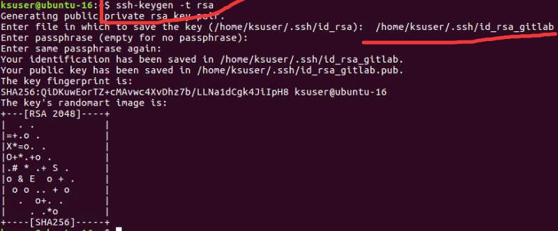
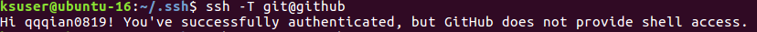

# 常用git总结
* ### 牢记git --help
* ### git六剑客
```bash  
 git clone
 git status
 git add
 git commit
 git pull
 git push  
```
* ### git其它
```Bash
 git checkout <branch> // 切换分支(切的分支改变代码未提交就切换到dev分支，以前好像貌似会提示需要先处理，现在我确定是直接将改变带回dev分支。所以需要先在分支上提交代码，再切换dev，才能互不影响的工作)
 git checkout -b <branch> // 创建并切换分支
 git checkout -- file // 从暂存区去除
 git diff file // 查看改变
 git merge <branch> // 合并分支
 git reste --hard(危险操作) // 退回版本 --hard直接覆盖掉，比较可怕的操作
 git rm file // 从版本库中删除
 git stash // 暂存
 git log // 查看git日志
 ...[--help]
```
* ### 经常发生的场景(待完善)
 1 同一个电脑多个git账号  
 > 假设企业邮箱为 qqqian0819@company.com,对应gitlab.  
私人邮箱为qqqian0819@gmail.com,对应github.
* 生成对应的PUBLIC KEY,图中标出的部分需要输入以下，其余一律回车。 

```bash
    ssh-keygen -t rsa
    /home/ksuser/.ssh/id_rsa_gitlab // 名字开心就好,重复上诉命令分别生成id_res_gitlab,id_rsa_github
```
*  .ssh 目录下的3个私钥添加的 ssh-agent
```bash
    ssh-add ~/.ssh/id_rsa_github
    ssh-add ~/.ssh/id_rsa_gitlab
```
* 网站配置
> 把id_rsa_github.pub 和 id_rsa_gitlab.pub添加到github,gitlab网站中的ssh keys中。
* 生成config文件
```bash
    cd ~/.ssh/
    touch config
```
* 配置config文件如下
```bash
    # Host: github,gitlab名字开就好。
    # IdentityFile 的文件路径名字对应刚才生成的key的文件路径及名字
    # gitlab的hostname需要公司的gitlab网址
    Host github
      HostName github.com
      User qqqian0819
      IdentityFile ~/.ssh/id_rsa_github
    Host gitlab
      HostName  https://gitlab.your.company.com
      User qqqian0819
      IdentityFile ~/.ssh/id_rsa_gitlab
```
* 查看是否成功
> github对应的是上面配置的Host。运行以下命令顺利的话会提示
```bash
    ssh -T git@github 
```

* 其他相关
```
  git config --global push.default matching:git push 会把你本地所有分支push到名称相对应的远程主机上。这意味着可能你会在不经意间push一些你原本没打算push的分支
git config --global push.default simple:git push仅仅把当前所在分支push到从当初git pull pull下来的那个对应分支上，另外，这个过程也会同时检查各个分支的名称是否相对应
```
 2 从其它仓库fork到自己仓库   
 3 已经push代码但是又有新代码需要提交，仍属于上一个commit的内容    
 4 已经push代码，但是需要撤回commit重新编辑commit信息  
 5 忘记pull代码直接push与仓库代码产生冲突  
 6 本地切分支
