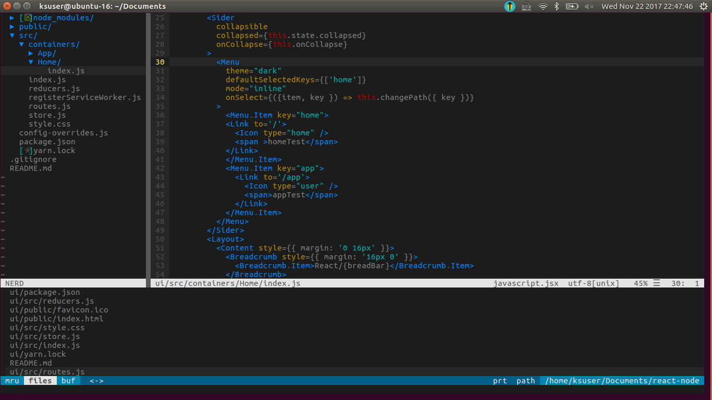

# 打造IDE般的vim  
### 效果图  
  
### 功能  
* 支持鼠标点击，支持Ctrl+c,Ctrl+v,Ctrl+z,Ctrl+a...  
* 支持语法高亮，ement，git，markdown...
* 打造IDE
### 步骤
安装ubuntu  
```bash
   sudo apt-get install vim
```
vim手册  
```bash 
    vumtutor  
 ```
安装插件管理器  [vim-plug](https://github.com/junegunn/vim-plug)  
```bash
    cd ~/ && mkdir -p .vim/autoload  
    curl -fLo ~/.vim/autoload/plug.vim --create-dirs \ https://raw.githubusercontent.com/junegunn/vim-plug/master/plug.vim 
```
配置vimrc
```bash
    cd /etc/vim  
    vim vimrc
```
> [配置文件](./vimrc)   
安装插件  
```bash
    vim  
    :PlugInstall  
```
主题(以vim-colors-solarized为例)
```bash
    cd ~/.vim  
    mkdir colors  
    cd ./plugged/vim-colors-solarized  
    cp ./colors/solarized.md ../../colors
```
插件介绍   
(待补充)
